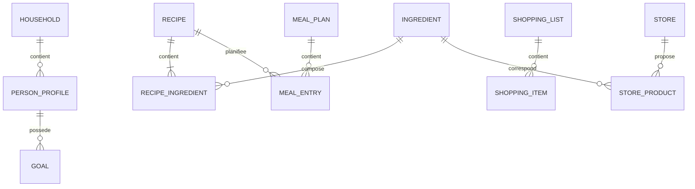

# Modèle métier initial

## Objectif

Ce document définit un vocabulaire commun. Il sera affiné par les user stories et les retours du Product Owner.

## Entités principales

| Entité | Responsabilité | Identité propre |
|---|---|---|
| `Household` | Contexte commun du foyer | Oui |
| `PersonProfile` | Contraintes, préférences et objectifs individuels | Oui |
| `Ingredient` | Aliment de référence et données nutritionnelles | Oui |
| `Recipe` | Composition, préparation et portions | Oui |
| `MealPlan` | Organisation des repas sur une période | Oui |
| `MealEntry` | Recette et portions pour un créneau | Oui |
| `ShoppingList` | Besoins agrégés d'un planning | Oui |
| `Store` | Enseigne et contexte géographique | Oui |
| `StoreProduct` | Conditionnement et prix observé | Oui |
| `ConsumedMeal` | Repas réellement consommé | Oui, extension |

## Value objects

| Type | Exemple | Invariant |
|---|---|---|
| `Quantity` | `250 g` | Valeur positive ou nulle, unité connue |
| `ServingCount` | `4 portions` | Entier strictement positif |
| `Money` | `12.50 EUR` | Montant et devise indissociables |
| `NutritionFacts` | kcal, protéines, glucides, lipides | Valeurs non négatives ou inconnues |
| `DateRange` | semaine du 15 au 21 septembre | Début antérieur ou égal à la fin |
| `Allergen` | lait, arachide | Valeur issue d'une liste contrôlée |
| `Equipment` | four, plaques, air fryer | Valeur normalisée |

## Relations



## Règles métier initiales

### Portions

Pour une recette de référence de (p_r) portions et une quantité (q_r), la quantité pour (p_c) portions est :

```text
q_cible = q_reference * p_cible / p_reference
```

Les conversions ne sont autorisées qu'entre unités compatibles.

### Nutrition

Les données d'un ingrédient sont conservées pour une quantité de référence, généralement 100 g. Les valeurs d'une recette sont la somme des contributions de ses ingrédients.

Une donnée inconnue reste inconnue. Elle ne doit pas être remplacée silencieusement par zéro.

### Restrictions strictes

Une recette est incompatible si au moins une contrainte stricte vérifiable est violée :

- allergène déclaré ;
- régime incompatible ;
- équipement indispensable absent.

Les préférences ne sont pas des restrictions strictes sauf choix explicite de l'utilisateur.

### Liste de courses

Les besoins sont calculés depuis les repas et portions planifiés. Deux lignes sont fusionnées uniquement si :

- elles désignent le même ingrédient canonique ;
- leurs unités sont identiques ou convertibles ;
- leur préparation ne rend pas les produits incompatibles.

### Prix

Un prix est associé à :

- un produit et son conditionnement ;
- un magasin ;
- une devise ;
- une date d'observation.

Le coût calculé est une estimation, notamment lorsque les conditionnements imposent d'acheter davantage que la quantité consommée.

## Moteur de recommandation

Le moteur suit trois étapes :

1. éliminer les recettes incompatibles ;
2. classer les recettes restantes ;
3. ajuster portions et composition du planning.

Score initial possible :

```text
score =
  poidsPreference * correspondancePreference
  + poidsNutrition * proximiteObjectif
  + poidsBudget * respectBudget
  + poidsVariete * variete
  - poidsRepetition * repetition
```

Les poids et facteurs doivent être documentés et testés. L'algorithme doit pouvoir expliquer les principales raisons du classement.

## Questions ouvertes

- Les contraintes sont-elles communes au foyer ou attachées à chaque personne ?
- Comment répartir les portions si les objectifs diffèrent entre personnes ?
- Quelles unités doivent être supportées dans le MVP ?
- Un ingrédient et un produit de magasin sont-ils liés manuellement ?
- Les restes et stocks du placard sont-ils pris en compte ?

