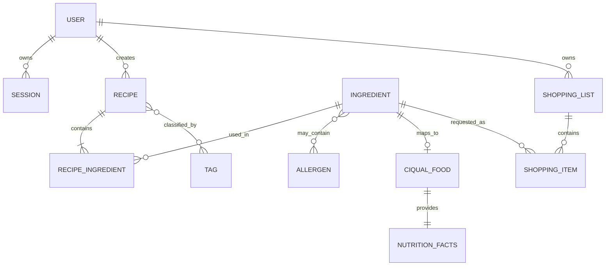

# Modèle métier initial

## Objectif

Ce modèle couvre le MVP validé : comptes, recettes, ingrédients, tags, nutrition, allergènes et listes de courses.

## Entités principales

| Entité | Responsabilité |
|---|---|
| `User` | Compte, identité et autorisations |
| `Session` | Session authentifiée et révocable |
| `Recipe` | Titre, description, portions, étapes et état |
| `RecipeIngredient` | Ingrédient, quantité, unité et ordre dans une recette |
| `Ingredient` | Aliment canonique et caractéristiques |
| `CiqualFood` | Entrée importée d'une version de CIQUAL |
| `NutritionFacts` | Énergie et nutriments pour une quantité de référence |
| `Allergen` | Référentiel séparé des allergènes |
| `Tag` | Classification éditoriale d'une recette |
| `ShoppingList` | Liste issue d'une ou plusieurs recettes |
| `ShoppingItem` | Ingrédient, quantité, unité et état coché |

## Relations



## Value objects

| Type | Exemple | Invariant |
|---|---|---|
| `Quantity` | `250 g` | Valeur positive, unité connue |
| `ServingCount` | `4 personnes` | Entier strictement positif |
| `NutritionFacts` | kcal, protéines, glucides, lipides | Valeurs non négatives ou inconnues |
| `EmailAddress` | `user@example.test` | Format normalisé |
| `RecipeTitle` | `Curry de pois chiches` | Non vide, longueur bornée |
| `TagName` | `gourmand` | Normalisé, unicité insensible à la casse |

## Règles métier

### Propriété et autorisation

- une action de modification nécessite un utilisateur authentifié ;
- un utilisateur ne modifie qu'une recette pour laquelle il possède l'autorisation requise ;
- une vérification côté client ne remplace jamais la vérification serveur ;
- la politique exacte de propriété et de rôles reste à confirmer avec le Product Owner.

### Recette

- un titre et un nombre de personnes sont obligatoires ;
- une recette contient des étapes ordonnées ;
- un ingrédient apparaît avec une quantité et une unité ;
- un tag éditorial n'est pas un allergène ;
- l'archivage est réversible tant que le Product Owner n'a pas demandé une suppression définitive.

### Portions

Pour une recette de référence de `p_reference` portions :

```text
quantite_cible = quantite_reference * portions_cibles / portions_reference
```

Les conversions ne sont autorisées qu'entre unités compatibles. La politique d'arrondi est centralisée et testée.

### Nutrition

- les données CIQUAL sont conservées pour leur quantité de référence ;
- les macros d'une recette sont la somme des contributions de ses ingrédients ;
- les valeurs totales et par portion sont calculées ;
- une donnée inconnue reste inconnue et n'est pas remplacée par zéro ;
- chaque résultat conserve la provenance et la version du jeu de données.

### Allergènes

- les allergènes sont associés explicitement aux ingrédients ;
- l'absence d'association n'implique pas automatiquement l'absence d'allergène ;
- le filtre exclut les incompatibilités connues ;
- une recette avec information incomplète peut être signalée comme incertaine ;
- aucune conclusion médicale n'est produite.

### Recherche et tags

- recherche par nom insensible à la casse ;
- recherche ou filtre par un ou plusieurs tags ;
- normalisation des espaces et de la casse ;
- les tags subjectifs comme `gourmand` restent séparés des données factuelles.

### Liste de courses

- les quantités proviennent des recettes et portions sélectionnées ;
- deux lignes sont regroupées seulement pour le même ingrédient canonique et des unités compatibles ;
- l'état coché appartient à chaque article ;
- la progression est dérivée :

```text
progression = nombre_articles_coches / nombre_total_articles
```

Une liste vide affiche `0/0`.

## Données CIQUAL minimales

```text
CiqualFood
  code
  name
  datasetVersion
  importedAt
  sourceUrl
  nutritionFacts

Ingredient
  id
  canonicalName
  ciqualCode?
  allergens[]
```

Le fichier CIQUAL brut est une source importée, pas le modèle applicatif directement exposé aux composants.

## Questions ouvertes

- inscription libre ou comptes préparés par l'équipe ;
- rôles et droits exacts ;
- recettes privées, publiques ou partagées ;
- liste officielle des allergènes du MVP ;
- tags libres ou administrés ;
- nombre de recettes pouvant alimenter une même liste ;
- moteur de base de données et technologie de session ;
- responsive Web seul ou PWA installable.

