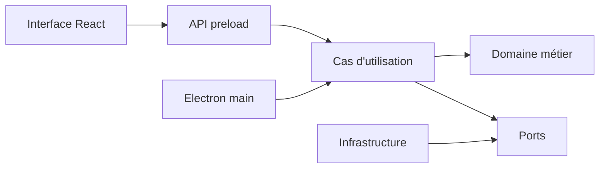
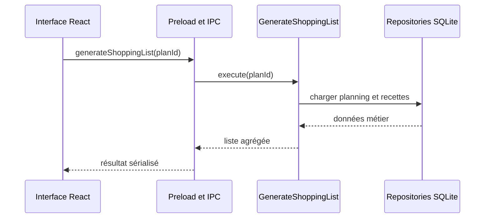

# Architecture générale

## Statut

Proposition initiale à valider par l'équipe pendant le Sprint 0.

## Style retenu

L'application suit une architecture de **monolithe modulaire local-first** :

- une seule application Electron est construite et distribuée ;
- le code est séparé par responsabilités ;
- le domaine métier reste indépendant de React, Electron et SQLite ;
- les dépendances techniques sont accessibles par des interfaces ;
- les données du MVP sont stockées localement.



## Responsabilités des couches

### `src/renderer`

- pages et composants React ;
- formulaires et interactions ;
- navigation ;
- affichage des erreurs ;
- état temporaire de l'interface.

Le renderer ne doit pas importer directement SQLite, `fs`, les repositories concrets ou les modules Node sensibles.

### `src/domain`

- entités et value objects ;
- règles nutritionnelles ;
- vérification des restrictions ;
- adaptation des portions ;
- agrégation des courses ;
- règles de sélection et de classement.

Cette couche doit pouvoir être testée sans Electron et sans base de données.

### `src/application`

- cas d'utilisation ;
- orchestration du domaine ;
- transactions applicatives ;
- interfaces de repositories et de fournisseurs ;
- conversion entre modèles d'entrée et résultats.

Exemples :

- `CreateHouseholdProfile` ;
- `SearchCompatibleRecipes` ;
- `CalculateRecipeNutrition` ;
- `CreateMealPlan` ;
- `GenerateShoppingList`.

### `src/infrastructure`

- connexion SQLite ;
- migrations ;
- repositories concrets ;
- import de jeux de données ;
- fournisseurs de données nutritionnelles ;
- fournisseurs de prix ou catalogues.

### `electron`

- cycle de vie de l'application ;
- création des fenêtres ;
- preload ;
- handlers IPC ;
- assemblage des implémentations.

### `src/shared`

Uniquement les éléments véritablement transverses :

- contrats IPC ;
- schémas de validation ;
- types d'erreurs ;
- unités et primitives partagées.

Ce dossier ne doit pas devenir un emplacement indifférencié pour le code métier.

## Structure cible

```text
electron/
  main.ts
  preload.ts
  ipc/
  bootstrap/
src/
  renderer/
    app/
    pages/
    features/
    components/
  domain/
    profile/
    recipe/
    nutrition/
    planning/
    shopping/
  application/
    profiles/
    recipes/
    planning/
    shopping/
    ports/
  infrastructure/
    database/
    repositories/
    providers/
  shared/
    contracts/
    validation/
    errors/
    units/
tests/
  unit/
  integration/
  component/
  e2e/
  fixtures/
```

## Règles de dépendance

Les dépendances autorisées sont :

```text
renderer -> contrats applicatifs
electron -> application
application -> domaine
infrastructure -> ports applicatifs + domaine
domaine -> aucune couche technique
```

Interdictions :

- `domain` ne dépend pas de React, Electron ou SQLite ;
- `renderer` n'accède pas directement à la base ;
- un composant React ne calcule pas les macros ;
- un handler IPC ne contient pas toute la logique d'un cas d'utilisation ;
- un repository ne décide pas si une recette respecte un régime ;
- les modules ne se contournent pas par des imports circulaires.

## Sécurité Electron

Configuration cible :

```ts
webPreferences: {
  preload: path.join(__dirname, 'preload.js'),
  nodeIntegration: false,
  contextIsolation: true,
  sandbox: true,
}
```

Le preload expose une API minimale au renderer. Toutes les entrées IPC sont validées. Les noms de canaux autorisés sont centralisés et les erreurs internes ne sont pas exposées telles quelles à l'interface.

La configuration initiale du dépôt utilise actuellement `nodeIntegration: true` et `contextIsolation: false`. Sa correction est une tâche bloquante du Sprint 0.

## Flux d'une action

Exemple : générer une liste de courses.



## Évolution

Une future API distante pourra implémenter les mêmes ports que SQLite. Cette possibilité ne justifie pas d'introduire un backend ou des microservices dans le MVP.

