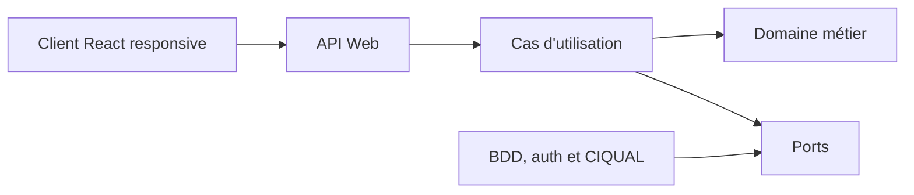
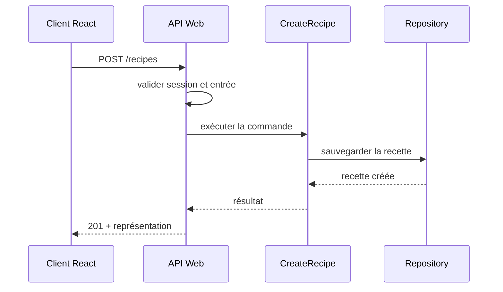

# Architecture générale

## Statut

Architecture cible issue du premier rendez-vous avec le Product Owner. Les frameworks serveur et base de données précis doivent être sélectionnés pendant le Sprint 0 et consignés dans des ADR complémentaires.

## Style retenu

L'application suit une architecture de **monolithe modulaire client-serveur** :

- une interface Web React conçue mobile-first ;
- une API TypeScript côté serveur ;
- un domaine métier indépendant des frameworks ;
- une base relationnelle côté serveur ;
- une authentification gérée côté serveur ;
- un module d'import versionné pour CIQUAL.



## Responsabilités

### `src/client`

- pages et composants React ;
- routage et formulaires ;
- conception mobile-first ;
- affichage des erreurs ;
- appels vers l'API par un client centralisé.

Le client ne contient pas les règles de calcul métier et n'accède jamais directement à la base.

### `src/server`

- démarrage du serveur ;
- routes HTTP ;
- validation des entrées ;
- authentification et autorisation ;
- traduction entre HTTP et cas d'utilisation ;
- gestion contrôlée des erreurs.

Une route ne doit pas contenir à elle seule la logique complète d'un cas d'utilisation.

### `src/domain`

- utilisateurs et autorisations métier ;
- recettes, ingrédients et tags ;
- portions et quantités ;
- données nutritionnelles ;
- allergènes ;
- listes de courses et progression.

Cette couche doit être testable sans React, serveur HTTP ou base de données.

### `src/application`

- cas d'utilisation ;
- orchestration du domaine ;
- interfaces des repositories et services externes ;
- transactions applicatives ;
- résultats indépendants du protocole HTTP.

Exemples :

- `AuthenticateUser` ;
- `CreateRecipe` ;
- `SearchRecipes` ;
- `ScaleRecipeServings` ;
- `ImportCiqualDataset` ;
- `GenerateShoppingList` ;
- `ToggleShoppingItem`.

### `src/infrastructure`

- base de données et migrations ;
- repositories concrets ;
- hachage des mots de passe et sessions ;
- import CIQUAL ;
- journalisation technique ;
- adaptateurs externes.

### `src/shared`

- contrats d'échange ;
- schémas de validation réellement partagés ;
- erreurs transverses ;
- unités et primitives communes.

## Structure cible

```text
src/
  client/
    app/
    pages/
    features/
      auth/
      recipes/
      ingredients/
      shopping/
    components/
  server/
    api/
    auth/
    middleware/
    bootstrap/
  domain/
    users/
    recipes/
    ingredients/
    nutrition/
    tags/
    shopping/
  application/
    auth/
    recipes/
    ingredients/
    shopping/
    ports/
  infrastructure/
    database/
    repositories/
    authentication/
    ciqual/
  shared/
    contracts/
    validation/
    errors/
    units/
tests/
  unit/
  integration/
  component/
  api/
  e2e/
  fixtures/
```

La structure exacte peut être adaptée au framework choisi, mais les frontières doivent rester reconnaissables.

## Règles de dépendance

```text
client -> API / contrats partagés
server -> application
application -> domaine
infrastructure -> ports applicatifs + domaine
domaine -> aucune couche technique
```

Interdictions :

- `domain` ne dépend pas de React, du serveur HTTP ou de la BDD ;
- le navigateur ne reçoit jamais un hash de mot de passe ;
- le client ne décide pas seul si une action est autorisée ;
- un composant React ne calcule pas directement les macros ;
- un repository ne décide pas si une recette contient un allergène ;
- l'import CIQUAL ne remplit pas les allergènes par supposition ;
- aucun import circulaire entre modules métier.

## Authentification et autorisation

- les mots de passe sont hachés par un algorithme adapté, jamais chiffrés ou stockés en clair ;
- les erreurs de connexion ne révèlent pas si un compte existe ;
- les sessions ou jetons sont invalidables ;
- les opérations de modification vérifient l'autorisation côté serveur ;
- les secrets ne sont jamais inclus dans le bundle Vite ;
- les cookies de session, si retenus, sont `HttpOnly`, `Secure` en production et configurés avec une politique `SameSite` appropriée ;
- la protection CSRF est évaluée selon le mécanisme de session choisi.

## Responsive mobile-first

- concevoir d'abord la largeur mobile cible ;
- éviter le défilement horizontal ;
- dimensionner les contrôles pour l'interaction tactile ;
- tester au moins un viewport mobile et un viewport desktop ;
- conserver les fonctionnalités essentielles sans dépendre du survol ;
- rendre visibles les erreurs et états de chargement.

## Flux d'une création de recette



## Migration depuis le prototype Electron

La migration doit être explicite :

1. conserver React, TypeScript et Vite ;
2. isoler ou retirer le plugin Electron ;
3. créer le serveur et un contrat d'API minimal ;
4. remplacer les accès desktop par des appels HTTP ;
5. supprimer Electron seulement lorsque le build Web, les tests et la CI sont opérationnels.

Le code existant et la documentation peuvent diverger pendant une courte branche de migration, jamais durablement sur `main`.

