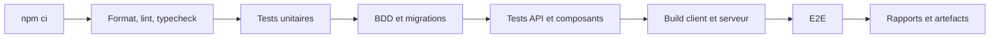

# Stratégie CI/CD

## Objectifs

Le pipeline doit :

- vérifier chaque Pull Request ;
- produire des preuves pour le rendu ;
- construire le client et le serveur ;
- tester les migrations ;
- préparer un déploiement Web reproductible ;
- empêcher une publication non validée.

## Intégration continue

Déclencheurs :

- Pull Request vers `main` ;
- push sur `main` ;
- lancement manuel ;
- tag de version pour la livraison.

## Jobs cibles

### `quality`

- installation reproductible ;
- formatage ;
- ESLint ;
- TypeScript ;
- tests unitaires ;
- couverture.

### `database`

- démarrage d'une base isolée ;
- application des migrations depuis zéro ;
- import d'un fixture CIQUAL réduit ;
- tests des repositories ;
- suppression de l'environnement temporaire.

### `build`

- build de production du client ;
- build ou compilation du serveur ;
- vérification des sorties ;
- contrôle qu'aucun secret n'est inclus dans le bundle client.

### `e2e`

- démarrage client, serveur et base de test ;
- compte de test isolé ;
- connexion ;
- création et recherche d'une recette ;
- génération et utilisation d'une checklist ;
- viewport mobile prioritaire et viewport desktop secondaire ;
- traces et captures conservées en cas d'échec.

### `security`

- audit des dépendances selon la politique retenue ;
- recherche de secrets ;
- vérification des permissions du workflow ;
- analyse statique disponible dans l'offre utilisée.

## Rapports ouverts

| Élément | Format |
|---|---|
| Tests | JUnit XML |
| Couverture | Cobertura XML et HTML |
| Analyse statique | SARIF si supporté |
| Backlog | CSV |
| Import CIQUAL | JSON ou CSV + log texte |
| Build | Logs et artefacts compressés |

Les artefacts de CI peuvent expirer. Les preuves significatives des sprints et releases doivent être exportées pour le rendu.

## Politique de fusion

Une Pull Request n'est fusionnée que si :

- les checks obligatoires réussissent ;
- au moins un autre étudiant l'approuve ;
- les discussions sont résolues ;
- les critères d'acceptation et la Definition of Done sont satisfaits ;
- les migrations et contrats d'API restent compatibles ;
- aucun secret ou fichier CIQUAL non autorisé n'est ajouté.

## Livraison continue contrôlée

Le projet utilise d'abord la **Continuous Delivery** : chaque version validée est déployable, mais la mise en production reste une décision humaine.

Environnements cibles :

- **CI éphémère** : tests ;
- **prévisualisation ou staging** : démonstration au Product Owner ;
- **production** : seulement si demandée.

Processus :

1. la CI construit et teste ;
2. une preview ou un staging est mis à jour ;
3. l'équipe démontre l'incrément ;
4. le Product Owner donne son retour ;
5. le backlog et le changelog sont mis à jour ;
6. une release est déclenchée explicitement si nécessaire.

## Migrations

- migrations versionnées et immuables après utilisation partagée ;
- test sur base vide ;
- données de test séparées ;
- sauvegarde avant migration d'un environnement durable ;
- aucun `reset` automatique en production.

## Critères Sprint 0

- [ ] Une Pull Request déclenche la CI.
- [ ] Lint, typecheck, tests et build Web passent.
- [ ] Une base vide peut être migrée.
- [ ] Un test API s'exécute.
- [ ] Un scénario mobile-first est vérifié.
- [ ] Les rapports sont consultables.
- [ ] Le mécanisme de staging ou de démonstration est documenté.

