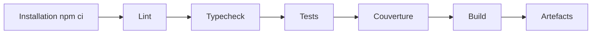

# Stratégie CI/CD

## Objectifs

Le pipeline doit :

- détecter rapidement les erreurs ;
- empêcher l'intégration d'un changement non vérifié ;
- produire des preuves consultables pour le rendu ;
- construire un artefact reproductible ;
- préparer une livraison contrôlée sans publier automatiquement une version non validée.

## Intégration continue

Déclencheurs cibles :

- ouverture ou mise à jour d'une Pull Request vers `main` ;
- push sur `main` ;
- lancement manuel pour diagnostic.

Pipeline minimal :

## Jobs proposés

### `quality`

- installation avec `npm ci` ;
- vérification du formatage ;
- ESLint ;
- TypeScript sans émission ;
- tests unitaires et d'intégration ;
- rapport de couverture.

### `build`

- dépend de `quality` ;
- construit le renderer et le processus Electron ;
- conserve les logs et sorties nécessaires au diagnostic ;
- vérifie que les fichiers attendus existent.

### `e2e`

- lancé sur Pull Request lorsque le parcours existe ;
- utilise une base temporaire et des données déterministes ;
- conserve traces et captures uniquement en cas d'échec, si possible.

### `package`

- lancé sur tag ou manuellement ;
- construit le package desktop pour la plateforme prise en charge ;
- produit une somme de contrôle ;
- ne publie pas automatiquement sans validation explicite.

## Rapports et formats ouverts

| Élément | Format recommandé |
|---|---|
| Tests | JUnit XML |
| Couverture | Cobertura XML et HTML |
| Analyse statique | SARIF lorsque supporté |
| Build | Logs texte et artefact compressé |
| Backlog | CSV exporté depuis GitHub Projects |

Les artefacts GitHub Actions peuvent expirer. Les rapports significatifs de chaque release ou sprint final doivent être téléchargés ou copiés dans le rendu.

## Politique de fusion

Une Pull Request n'est fusionnée que si :

- les checks obligatoires réussissent ;
- au moins un autre étudiant l'approuve ;
- les conversations sont résolues ;
- la branche ne contient pas de secret ;
- les critères d'acceptation et la Definition of Done sont respectés.

## Livraison continue contrôlée

Pour ce projet, CD signifie d'abord **Continuous Delivery** : chaque version validée peut être construite automatiquement, mais sa publication reste une décision humaine.

Processus de release proposé :

1. le Product Owner valide l'incrément présenté ;
2. les développeurs mettent à jour `CHANGELOG.md` ;
3. une version est choisie selon `MAJOR.MINOR.PATCH` ;
4. un tag signé ou protégé est créé ;
5. le workflow de packaging construit l'artefact ;
6. l'équipe vérifie l'installation et le parcours principal ;
7. la release GitHub est publiée avec notes et limites connues.

## Versionnement

Avant une première version stable :

- `0.1.0` : premier incrément démontrable ;
- `0.2.0` : ajout fonctionnel compatible ;
- `0.2.1` : correction sans nouvelle fonctionnalité ;
- `1.0.0` : périmètre MVP accepté et processus de release éprouvé.

## Secrets

- utiliser les secrets GitHub uniquement si nécessaires ;
- limiter leurs permissions ;
- ne jamais les afficher dans les logs ;
- éviter les workflows exécutant du code non fiable avec accès aux secrets ;
- le build du MVP ne doit idéalement dépendre d'aucun secret.

## Critères d'acceptation du pipeline Sprint 0

- [ ] Une Pull Request déclenche la CI.
- [ ] Un échec de lint fait échouer le workflow.
- [ ] Un test en échec bloque le pipeline.
- [ ] Le typecheck s'exécute séparément.
- [ ] Le build réussit depuis un clone propre.
- [ ] Le rapport de tests est consultable.
- [ ] Les jobs et leurs objectifs sont documentés.

