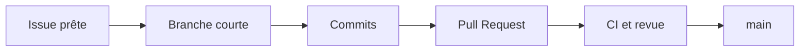

# Workflow Git et traçabilité

## Branches

Le dépôt utilise un trunk-based development simple autour de `main` avec des branches courtes.



Il n'existe pas de branche permanente par membre.

## Convention de nommage

```text
feature/18-allergy-filter
fix/27-macro-calculation
refactor/32-recipe-repository
test/41-shopping-list-units
docs/45-sprint-review
chore/51-vitest-setup
```

## Cycle d'une modification

1. sélectionner une issue prête dans le Sprint Backlog ;
2. s'assigner l'issue ;
3. mettre `main` à jour ;
4. créer une branche depuis `main` ;
5. effectuer des commits ciblés ;
6. exécuter les contrôles locaux ;
7. pousser la branche ;
8. ouvrir une Pull Request avec `Closes #<numéro>` ;
9. demander une revue ;
10. corriger les remarques et attendre la CI ;
11. fusionner ;
12. supprimer la branche et vérifier la fermeture de l'issue.

## Politique de `main`

Configuration cible GitHub :

- fusion uniquement par Pull Request ;
- au moins une approbation ;
- conversations résolues ;
- checks CI obligatoires ;
- branche à jour avant fusion si la plateforme le permet ;
- suppression automatique des branches fusionnées ;
- interdiction des force-push sur `main`.

Si le plan GitHub utilisé ne permet pas d'imposer une règle, l'équipe l'applique manuellement et le documente.

## Pull Requests

Une Pull Request doit rester centrée sur une intention. Au-delà d'environ 400 lignes significatives modifiées, l'auteur vérifie si elle peut être découpée. Ce seuil est un signal, pas une règle absolue.

Une PR d'interface contient une capture ou une courte vidéo. Une PR de règle métier contient des tests. Une PR d'architecture met à jour un ADR si la décision est durable.

## Gestion des conflits

- intégrer `main` régulièrement dans une branche longue exceptionnelle ;
- éviter les refactorings globaux pendant que plusieurs membres modifient les mêmes fichiers ;
- communiquer avant de déplacer ou renommer un module partagé ;
- résoudre les conflits avec la personne qui connaît le mieux la zone affectée ;
- réexécuter tous les tests après résolution.

## Traçabilité attendue

```text
Besoin du Product Owner
  -> Epic
  -> User story / Issue
  -> Branche
  -> Commits
  -> Pull Request
  -> Tests et rapport CI
  -> Incrément démontré
  -> Retour de Sprint Review
```

Une fonctionnalité sans issue ou une issue sans preuve d'intégration constitue une rupture de traçabilité.

